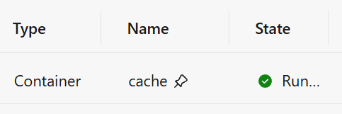

# Advanced Container Management in .NET Aspire

## Introduction

Let's take our .NET Aspire skills to the next level! In this module, we'll dive into the world of advanced container management - a crucial skill for making your cloud applications production-ready.

We'll explore how to:
- Control container lifetimes (keep them running even when you stop debugging!)
- Persist data between container restarts (no more losing your Redis cache!)
- Fine-tune container resource settings (because sharing is caring, but not with CPU cores)
- Set up custom networking (containers need their personal space too)

These skills will help you build robust, production-ready applications while making your development workflow smoother and more efficient. Let's get started!

## Container Lifecycle Management

When you run your Aspire App Host project, here's what happens by default:

1. Your projects and containers spring to life
2. Docker downloads any images it needs
3. Everything runs happily... until you stop debugging
4. Then all your containers shut down and your data disappears 😢

This works fine for basic development, but .NET Aspire 9 introduced something better: **persistent containers**! This means your containers can:

- Stay alive even after you stop debugging (no more waiting for downloads!)
- Keep all their data between runs (your settings, caches, everything!)
- Be controlled independently (want to test how your app handles Redis going down? No problem!)

Let's implement this with our Redis cache.

## Setting Up Persistent Containers

Ready to make your Redis container stick around? Let's update our App Host:

1. Open the `Program.cs` file in the `AppHost` project.
2. Find where you added Redis:

   ```csharp
   var cache = builder.AddRedis("cache")
       .WithRedisInsight();
   ```

3. Add the magical `.WithLifetime` method:

   ```csharp
   var cache = builder.AddRedis("cache")
       .WithRedisInsight()
       .WithLifetime(ContainerLifetime.Persistent);
   ```

That's it! Now your Redis container will keep running even when you stop debugging. The next time you run your app, it'll connect to the existing container instead of starting a new one. 

> 💡 **Pro tip**: Notice how much faster your app starts now? No more waiting for container downloads and initialization!

## How .NET Aspire Knows Which Container to Use

You might wonder: "How does Aspire know which existing container to use?" Great question! It uses several factors:

- Container name (based on your App Host project path)
- Container image and startup commands
- Volume mounts, ports, environment variables, etc.

If any of these change, Aspire creates a new container. For even more control, you can specify a custom container name:

```csharp
var cache = builder.AddRedis("cache")
    .WithLifetime(ContainerLifetime.Persistent)
    .WithContainerName("my-awesome-redis");
```

This way, you'll always get the exact same container, even if you move your project around.

## Making Your Data Survive Container Restarts

While persistent containers are great, what about the data inside them? By default, if a container is removed or recreated, all its data is lost. Let's fix that!

### Option 1: Named Volumes - The Easy Way

Named volumes are the simplest way to persist data. They're managed by Docker but accessible to your containers:

```csharp
var cache = builder.AddRedis("cache")
    .WithRedisInsight()
    .WithLifetime(ContainerLifetime.Persistent)
    .WithDataVolume("my-redis-data");
```

This creates a volume named `my-redis-data` that will store your Redis data. Even if your container is removed, the volume remains, and your data is waiting for the next container that connects to it.

### Option 2: Directory Bind Mounts - For Direct Access

Sometimes you want to see and modify your container's files directly. That's where bind mounts come in:

```csharp
var cache = builder.AddRedis("cache")
    .WithRedisInsight()
    .WithLifetime(ContainerLifetime.Persistent)
    .WithDataBindMount(@"C:\Redis\Data");
```

Now you can open `C:\Redis\Data` in Explorer and see all your Redis files. This is super useful for debugging or manually importing/exporting data.

### Configuring Redis Persistence

Redis has its own data persistence mechanisms. We can configure Redis to save snapshots of your data:

```csharp
var cache = builder.AddRedis("cache")
    .WithRedisInsight()
    .WithLifetime(ContainerLifetime.Persistent)
    .WithDataVolume("my-redis-data")
    .WithPersistence(interval: TimeSpan.FromMinutes(5), keysChangedThreshold: 100);
```

This tells Redis: "Take a snapshot every 5 minutes OR when 100 keys have changed - whichever happens first."

## Controlling Resources from the Dashboard

One of the coolest features in .NET Aspire 9 is the ability to control your resources directly from the dashboard. Let's try it out:

1. Start your App Host project
2. Open the .NET Aspire Dashboard
3. Look for the Redis resource - notice the little pin icon? That's showing it's persistent!



4. Click the "Stop" button to stop your Redis container
5. Watch how your application reacts (spoiler: it probably won't handle it well!)
6. Click "Start" to bring Redis back to life
7. See your app recover automatically

This is an amazing way to test resilience without restarting your entire debug session. Want to see how your app handles database outages? Just click "Stop" on your database container!

## Let's Test Our Super-Powered Redis Setup

Time to see all this in action:

1. Start the App Host project
2. When the dashboard opens, open Redis Insight and create a test key
3. Stop the App Host completely
4. Start the App Host again - notice how much faster Redis starts up?
5. Check Redis Insight - your test key should still be there!
6. Try stopping just the Redis container using the dashboard controls
7. Watch how your application handles the Redis outage
8. Start Redis again and see your application recover

## Summary

Congratulations! You've mastered advanced container management in .NET Aspire. Let's recap what you've learned:

- How to make containers persist between debug sessions
- Ways to preserve data using volumes and bind mounts
- Techniques for configuring Redis persistence
- Methods for limiting resources and isolating containers
- Using the dashboard to control individual resources

These techniques will make your development workflow smoother and your applications more robust. The best part? These same principles apply to any containerized service in .NET Aspire, not just Redis.

## Bonus Adventures for the Curious

Want to explore even more advanced scenarios? Check out these samples from the [aspire-samples](https://github.com/dotnet/aspire-samples) repository:

### Advanced Metrics with Prometheus and Grafana

The [Metrics sample](https://github.com/dotnet/aspire-samples/tree/main/samples/Metrics) shows how to create beautiful dashboards for your metrics data. You'll learn:

- How to add Prometheus as a metrics collector
- Setting up Grafana for professional visualization
- Creating custom dashboard panels for your specific needs

This is perfect if you need more advanced monitoring than what the built-in Aspire dashboard provides.

### Mixing .NET with Other Languages

The [Container Build sample](https://github.com/dotnet/aspire-samples/tree/main/samples/ContainerBuild) demonstrates how to include non-.NET services in your Aspire application. In this example, a Go/gin service plays nicely with .NET services.

You'll discover:
- How to build custom containers for non-.NET code
- Techniques for service discovery across technology boundaries
- Ways to maintain a consistent development experience in a polyglot environment

This is invaluable when working with existing microservices or when certain components are better built with other technologies.

**Next**: [Module #11: Azure Integrations](11-azure-integrations.md)

