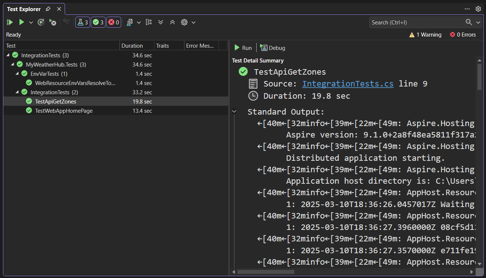

# Integration Testing with .NET Aspire

## Introduction

In this module, we will cover integration testing using `Aspire.Hosting.Testing` with `MSTest`. Integration testing is crucial for ensuring that different parts of your application work together as expected. We will create a separate test project to test both the API and the web application.

## Difference Between Unit Testing and Integration Testing

Unit testing focuses on testing individual components or units of code in isolation. It ensures that each unit functions correctly on its own. In contrast, integration testing verifies that different components of the application work together as expected. It tests the interactions between various parts of the system, such as APIs, databases, and web applications.

In the context of distributed applications with .NET Aspire, integration testing is essential to ensure that the different services and components communicate and function correctly together.

## Creating the Integration Test Project

1. Create a new test project named `IntegrationTests`.
1. Add references to the required packages in the `IntegrationTests.csproj` file:

```xml
<Project Sdk="Microsoft.NET.Sdk">
    <PropertyGroup>
        <TargetFramework>net9.0</TargetFramework>
        <ImplicitUsings>enable</ImplicitUsings>
        <Nullable>enable</Nullable>
        <IsPackable>false</IsPackable>
        <IsTestProject>true</IsTestProject>
    </PropertyGroup>

    <PropertyGroup>
        <EnableMSTestRunner>true</EnableMSTestRunner>
        <OutputType>Exe</OutputType>
    </PropertyGroup>

    <ItemGroup>
        <PackageReference Include="Aspire.Hosting.Testing" Version="9.1.0" />
        <PackageReference Include="MSTest" Version="3.8.2" />
    </ItemGroup>

    <ItemGroup>
        <ProjectReference Include="..\AppHost\AppHost.csproj" />
    </ItemGroup>

    <ItemGroup>
        <Using Include="System.Net" />
        <Using Include="Microsoft.Extensions.DependencyInjection" />
        <Using Include="Aspire.Hosting.ApplicationModel" />
        <Using Include="Aspire.Hosting.Testing" />
        <Using Include="Microsoft.VisualStudio.TestTools.UnitTesting" />
    </ItemGroup>
</Project>
```

This project file is fairly standard for a test project. The key elements are:

- A `PackageReference` to the [Aspire.Hosting.Testing](https://www.nuget.org/packages/Aspire.Hosting.Testing) NuGet package, which provides the necessary types and APIs for testing .NET Aspire applications.
- A `ProjectReference` to the AppHost project, which gives the test project access to the target distributed application definition.
- The `EnableMSTestRunner` and `OutputType` settings to configure the test project to run with the native MSTest runner.

1. Create test classes for integration tests:

The `IntegrationTests.cs` file tests the API and web application functionality:

```csharp
namespace MyWeatherHub.Tests;

[TestClass]
public class IntegrationTests
{
    [TestMethod]
    public async Task TestApiGetZones()
    {
        // Arrange
        var appHost = await DistributedApplicationTestingBuilder
            .CreateAsync<Projects.AppHost>();

        appHost.Services.ConfigureHttpClientDefaults(clientBuilder =>
        {
            clientBuilder.AddStandardResilienceHandler();
        });

        await using var app = await appHost.BuildAsync();

        var resourceNotificationService = app.Services
            .GetRequiredService<ResourceNotificationService>();

        await app.StartAsync();

        // Act
        var httpClient = app.CreateHttpClient("api");

        await resourceNotificationService.WaitForResourceAsync(
                "api",
                KnownResourceStates.Running
            )
            .WaitAsync(TimeSpan.FromSeconds(30));

        var response = await httpClient.GetAsync("/zones");

        // Assert
        response.EnsureSuccessStatusCode();
        var zones = await response.Content.ReadFromJsonAsync<Zone[]>();
        Assert.IsNotNull(zones);
        Assert.IsTrue(zones.Length > 0);
    }

    [TestMethod]
    public async Task TestWebAppHomePage()
    {
        // Arrange
        var appHost = await DistributedApplicationTestingBuilder
            .CreateAsync<Projects.AppHost>();

        appHost.Services.ConfigureHttpClientDefaults(clientBuilder =>
        {
            clientBuilder.AddStandardResilienceHandler();
        });

        await using var app = await appHost.BuildAsync();

        var resourceNotificationService = app.Services
            .GetRequiredService<ResourceNotificationService>();

        await app.StartAsync();

        // Act
        var httpClient = app.CreateHttpClient("myweatherhub");

        await resourceNotificationService.WaitForResourceAsync(
                "myweatherhub",
                KnownResourceStates.Running
            )
            .WaitAsync(TimeSpan.FromSeconds(30));

        var response = await httpClient.GetAsync("/");

        // Assert
        response.EnsureSuccessStatusCode();
        var content = await response.Content.ReadAsStringAsync();
        Assert.IsTrue(content.Contains("MyWeatherHub"));
    }
}

public record Zone(string Key, string Name, string State);
```

This test class demonstrates how to test your distributed application. Let's examine what these tests are doing:

- Both tests follow a similar pattern, utilizing `DistributedApplicationTestingBuilder.CreateAsync<Projects.AppHost>()` to asynchronously create an instance of your application host.
- The `appHost` is configured with standard HTTP resilience handlers, which provide retry policies and circuit breakers for more robust HTTP communication.
- The test calls `appHost.BuildAsync()` to build the application and then retrieves the `ResourceNotificationService` from the DI container.
- After starting the app with `app.StartAsync()`, an `HttpClient` is created specifically for the resource being tested (either "api" or "myweatherhub").
- The test waits for the target resource to reach the "Running" state before proceeding, ensuring the service is ready to accept requests.
- Finally, HTTP requests are made to specific endpoints, and assertions verify the responses.

In the first test, we verify that the API's `/zones` endpoint returns a valid collection of zone data. In the second test, we check that the web application's homepage loads successfully and contains the expected content.

The `EnvVarTests.cs` file verifies environment variable resolution:

```csharp
namespace MyWeatherHub.Tests;

[TestClass]
public class EnvVarTests
{
    [TestMethod]
    public async Task WebResourceEnvVarsResolveToApiService()
    {
        // Arrange
        var appHost = await DistributedApplicationTestingBuilder
            .CreateAsync<Projects.AppHost>();

        var frontend = (IResourceWithEnvironment)appHost.Resources
            .Single(static r => r.Name == "myweatherhub");

        // Act
        var envVars = await frontend.GetEnvironmentVariableValuesAsync(
            DistributedApplicationOperation.Publish);

        // Assert
        CollectionAssert.Contains(envVars,
            new KeyValuePair<string, string>(
                key: "services__api__https__0",
                value: "{api.bindings.https.url}"));
    }
}
```

This test focuses on verifying service discovery configuration:

- It uses `DistributedApplicationTestingBuilder.CreateAsync<Projects.AppHost>()` to create an instance of the application host.
- Instead of starting the application, it directly retrieves an `IResourceWithEnvironment` instance representing the web frontend ("myweatherhub").
- It calls `GetEnvironmentVariableValuesAsync()` with the `DistributedApplicationOperation.Publish` argument to get the environment variables that would be published to the resource.
- Finally, it asserts that the web frontend has an environment variable that resolves to the API service's URL, confirming that service discovery is properly configured.

This test is particularly valuable because it verifies that your application's services are correctly wired together through environment variables, which is how .NET Aspire handles service discovery in distributed applications.

## Running the Integration Tests

### Using the Command Line

1. Open a terminal and navigate to the `complete` folder.
1. Run the integration tests using the `dotnet test` command:

```bash
dotnet test IntegrationTests/IntegrationTests.csproj
```

### Using Visual Studio Test Explorer

1. Open the solution in Visual Studio
1. Open the Test Explorer by going to View > Test Explorer (or press Ctrl+E, T)
1. In the Test Explorer window, you'll see all the tests in your solution



1. You can:
   - Run all tests by clicking the "Run All" button at the top
   - Run a specific test by right-clicking it and selecting "Run"
   - Run failed tests only by clicking the "Run Failed Tests" button
   - Run tests in debug mode by right-clicking and selecting "Debug"
   - View test results and output in the Test Explorer window

The tests will verify that:

- Environment variables are properly configured
- The API endpoints are working correctly
- The web application is functioning as expected

When running these tests, all resource logs are redirected to the `DistributedApplication` by default. This log redirection enables scenarios where you want to assert that a resource is logging correctly, though we're not doing that in these particular tests.

## Additional Testing Tools

Playwright is a powerful tool for end-to-end testing. It allows you to automate browser interactions and verify that your application works as expected from the user's perspective. Playwright supports multiple browsers, including Chromium, Firefox, and WebKit.

### Use Case

Playwright can be used to perform end-to-end testing of your web application. It can simulate user interactions, such as clicking buttons, filling out forms, and navigating between pages. This ensures that your application behaves correctly in real-world scenarios.

### High-Level Concepts

- **Browser Automation**: Playwright can launch and control browsers to perform automated tests.
- **Cross-Browser Testing**: Playwright supports testing across different browsers to ensure compatibility.
- **Headless Mode**: Playwright can run tests in headless mode, which means the browser runs in the background without a graphical user interface.
- **Assertions**: Playwright provides built-in assertions to verify that elements are present, visible, and have the expected properties.

For more information on Playwright, refer to the [official documentation](https://playwright.dev/dotnet/).

## Conclusion

In this module, we covered integration testing using `Aspire.Hosting.Testing` with `MSTest`. We created a separate test project to test both the API and the web application, following patterns similar to the `WebApplicationFactory` approach in ASP.NET Core but adapted for distributed applications.

Our tests verified three critical aspects of the distributed application:
1. The API functionality (testing that endpoints return expected data)
1. The web application functionality (testing that the UI renders correctly)
1. The service discovery mechanism (testing that services can find and communicate with each other)

For a deeper dive into testing with .NET Aspire, including a video walkthrough, check out the [Getting started with testing and .NET Aspire](https://devblogs.microsoft.com/dotnet/getting-started-with-testing-and-dotnet-aspire/) blog post.

Now, let's learn about deployment options when using .NET Aspire.

**Next**: [Module #9: Deployment](./9-deployment.md)
